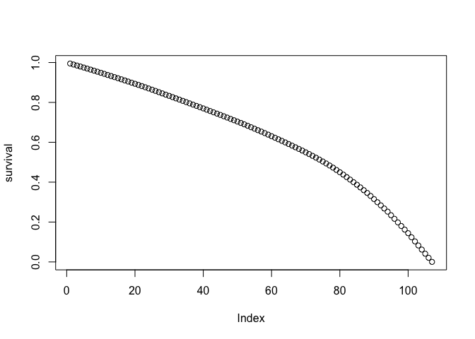

<!-- README.md is generated from README.Rmd. Please edit that file -->

# Ariana

<!-- badges: start -->
<!-- badges: end -->

The goal of Ariana is to computer survival probabilities

## Installation

You can install the development version of Ariana from
[GitHub](https://github.com/) with:

``` r
# install.packages("devtools")
devtools::install_github("arianahaha/Ariana")
```

## Example

This is a basic example which shows you how to solve a common problem:

``` r
library(Ariana)
time = c(1:200)
event = sample(c(0,1), replace=TRUE, size=200)

survival = survival.probs(time, event)
```

You’ll still need to render `README.Rmd` regularly, to keep `README.md`
up-to-date. `devtools::build_readme()` is handy for this. You could also
use GitHub Actions to re-render `README.Rmd` every time you push. An
example workflow can be found here:
<https://github.com/r-lib/actions/tree/v1/examples>.

You can also embed plots, for example:



In that case, don’t forget to commit and push the resulting figure
files, so they display on GitHub and CRAN.
